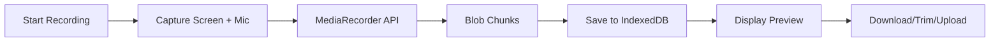
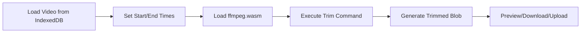
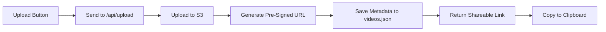

# 🎥 Screen Recorder MVP

> **Marvedge Assignment Submission**  
> A production-ready screen recording application built with **Next.js 16 + TypeScript**, demonstrating browser video recording, client-side trimming, cloud storage, shareable links, and analytics tracking.

---

## 📋 Table of Contents

- [Features](#-features)
- [Tech Stack](#-tech-stack)
- [Project Structure](#-project-structure)
- [Setup Instructions](#-setup-instructions)
- [Architecture Decisions](#-architecture-decisions)
- [How It Works](#-how-it-works)
- [Production Improvements](#-production-improvements)

---

## ✨ Features

### 1. **In-Browser Screen Recording**
- Records **screen + microphone audio** using MediaRecorder API
- Start/Stop controls with real-time preview
- Saves output as `.webm` format
- **Persistent storage** using IndexedDB (survives page refreshes)

### 2. **Video Trimming**
- Client-side trimming with **ffmpeg.wasm**
- Set custom start and end times
- Preview trimmed output before saving
- Download trimmed video locally

### 3. **Upload & Share**
- Upload videos to **AWS S3**
- Generate **pre-signed URLs** (7-day validity)
- Public shareable video page
- Copy-to-clipboard functionality

### 4. **Analytics Tracking**
- **View count** tracking
- **Watch completion percentage** (average across sessions)
- **File-based persistence** (`analytics.json`)
- Real-time analytics display on video pages

### 5. **Additional Features**
- Dark/Light mode toggle
- Responsive design
- Video library page with metadata
- Error handling and loading states

---

## 🛠 Tech Stack

| Category | Technology |
|----------|-----------|
| **Framework** | Next.js 16 (App Router) |
| **Language** | TypeScript |
| **Styling** | Tailwind CSS v4 |
| **Video Recording and Processing** | MediaRecorder API and ffmpeg.wasm (client-side) |
| **Storage** | AWS S3 + IndexedDB |
| **UI Components** | ShadCN UI and Radix UI |
| **Theme** | next-themes |
| **Icons** | Lucide React |

---

## 📁 Project Structure

```
screen-recorder-mvp/
├── app/
│   ├── api/
│   │   ├── analytics/
│   │   │   └── route.ts          # Analytics tracking endpoints
│   │   ├── upload/
│   │   │   └── route.ts          # S3 upload handler
│   │   └── videos/
│   │       ├── route.ts          # List all videos with analytics
│   │       └── [id]/
│   │           └── route.ts      # Generate pre-signed URLs
│   │
│   ├── recording/
│   │   └── page.tsx              # Recording interface
│   ├── trim/
│   │   └── page.tsx              # Video trimming interface
│   ├── videos/
│   │   ├── page.tsx              # Video library
│   │   └── [id]/
│   │       └── page.tsx          # Public video player + analytics
│   │
│   ├── layout.tsx                # Root layout with theme provider
│   ├── page.tsx                  # Landing page
│   └── globals.css               # Global styles
│
├── components/
│   ├── Recorder.tsx              # Recording logic + upload
│   ├── Navbar.tsx                # Navigation bar
│   ├── theme-provider.tsx        # Theme context provider
│   └── ui/
│       ├── button.tsx            # Button component
│       ├── ModeToggle.tsx        # Dark/Light mode toggle
│       └── dropdown-menu.tsx     # Dropdown menu component
│
├── lib/
│   ├── videoStore.ts             # IndexedDB persistence layer
│   ├── s3.ts                     # AWS S3 client configuration
│   ├── analyticsStore.ts         # File-based analytics storage
│   ├── videoMetadataStore.ts     # Video metadata management
│   └── utils.ts                  # Utility functions
│
├── analytics.json                # Analytics data store
├── videos.json                   # Video metadata store
├── .env.local                    # Environment variables (not committed)
├── .env.example                  # Example environment variables
└── package.json
```

---

## 🚀 Setup Instructions

### Prerequisites
- Node.js 18+ installed
- AWS account with S3 bucket configured
- Git installed

### 1. Clone the Repository
```bash
git clone <repository-url>
cd screen-recorder-mvp
```

### 2. Install Dependencies
```bash
npm install
```

### 3. Configure Environment Variables

Create a `.env.local` file in the root directory:

```env
# AWS Configuration
AWS_REGION=eu-north-1
AWS_ACCESS_KEY_ID=your_access_key_here
AWS_SECRET_ACCESS_KEY=your_secret_key_here
AWS_S3_BUCKET_NAME=your-bucket-name

# Application URL (for shareable links)
NEXT_PUBLIC_APP_URL=http://localhost:3000
```

### 4. Configure AWS S3 Bucket

#### Create S3 Bucket
1. Go to AWS S3 Console
2. Create a new bucket (e.g., `marvedge-recorder-mvp`)
3. Enable public access if needed for direct video playback

#### Create IAM User
1. Create an IAM user with programmatic access
2. Attach policy: `AmazonS3FullAccess` (or create custom policy)
3. Save Access Key ID and Secret Access Key

### 5. Run Development Server
```bash
npm run dev
```

Visit `http://localhost:3000`

### 6. Build for Production
```bash
npm run build
npm start
```

---

## 🧠 Architecture Decisions

### **1. No Authentication (Intentional)**

Authentication was **deliberately excluded** to focus on core functionality:
- Recording
- Trimming
- Upload/Share
- Analytics

**When to add authentication:**
- User-owned videos
- Private video access
- User dashboards
- Billing/subscriptions

---

### **2. IndexedDB for Local Persistence**

**Why not `sessionStorage`?**
- Video blobs can be **hundreds of MBs**
- `sessionStorage` has strict size limits (5-10MB)
- IndexedDB supports:
  - Large binary storage
  - Persistence across page reloads
  - Non-blocking async operations

**Implementation:**
```typescript
// lib/videoStore.ts
export async function saveVideo(key: string, blob: Blob) {
  const db = await openDB();
  const tx = db.transaction(STORE_NAME, "readwrite");
  tx.objectStore(STORE_NAME).put(blob, key);
  // ...
}
```

---

### **3. Client-Side Trimming (ffmpeg.wasm)**

**Why client-side?**
- ✅ No server processing costs
- ✅ Instant feedback
- ✅ Privacy (video never leaves browser until upload)
- ✅ Scalable (no backend bottleneck)

**Trade-offs:**
- ❌ Slower on low-end devices
- ❌ Requires modern browser support

**Production alternative:** Server-side FFmpeg with Lambda/Cloud Functions

---

### **4. Separate Trim Page**

**Design rationale:**
```
Record → Download → Trim → Upload → Share
```

**Benefits:**
- Clear separation of concerns
- User can verify output before uploading
- Prevents accidental uploads
- Easier to maintain and extend

---

### **5. File-Based Analytics**

**Why not a database?**
- ✅ Fits MVP scope
- ✅ Simple, debuggable
- ✅ No external dependencies
- ✅ Easy to migrate later

**Data structure:**
```json
{
  "video-id": {
    "views": 10,
    "totalWatchTime": 245,
    "duration": 60,
    "watchSessions": [85, 92, 78, 100]
  }
}
```

**Production migration path:** PostgreSQL, DynamoDB, or MongoDB

---

### **6. Pre-Signed URLs**

**Why pre-signed URLs?**
- ✅ Secure access without making bucket public
- ✅ Time-limited (7 days for share links, 1 hour for playback)
- ✅ No authentication required for viewers

**Implementation:**
```typescript
const signedUrl = await getSignedUrl(s3, getObjectCommand, {
  expiresIn: 604800, // 7 days
});
```

---

## 🔄 How It Works

### **Recording Flow**



1. User clicks "Start Recording"
2. Browser requests screen + microphone permissions
3. `MediaRecorder` captures combined stream
4. On stop, blob is saved to **IndexedDB**
5. Video persists across page refreshes

---

### **Trimming Flow**



1. Retrieve video from IndexedDB
2. Load ffmpeg.wasm (CDN)
3. User sets trim points
4. Execute: `ffmpeg -i input.webm -ss START -to END -c copy output.webm`
5. Generate trimmed blob for preview/upload

---

### **Upload & Share Flow**



1. User clicks "Save and Share"
2. Video blob sent to `/api/upload`
3. Server uploads to S3 with unique ID
4. Generate 7-day pre-signed URL
5. Save metadata (`videos.json`)
6. Return shareable link to user

---

### **Analytics Tracking**

**View Tracking:**
- Triggered on video page load (external links only)
- Skips tracking for internal navigation (`?internal=true`)
- Uses `sessionStorage` to prevent double-counting

**Watch Completion:**
- Tracks `currentTime` vs `duration`
- Records completion percentage per session
- Updates every 5 seconds during playback
- Calculates average across all sessions

**Data Flow:**
```
Video Page → POST /api/analytics → analyticsStore.ts → analytics.json
```

---

## 🚀 Production Improvements

### **1. Authentication & Authorization**
- [ ] Implement NextAuth.js or Clerk
- [ ] User-owned videos
- [ ] Private/public video toggle
- [ ] Role-based access control

### **2. Database Migration**
- [ ] Replace `videos.json` with PostgreSQL/Supabase
- [ ] Replace `analytics.json` with time-series DB (InfluxDB/TimescaleDB)
- [ ] Add video thumbnails table
- [ ] Implement proper indexing

### **3. Video Processing**
- [ ] Server-side FFmpeg (AWS Lambda/Cloud Functions)
- [ ] Generate video thumbnails
- [ ] Support multiple formats (MP4, MOV)
- [ ] Video compression/optimization
- [ ] Adaptive bitrate streaming (HLS/DASH)

### **4. Performance Optimizations**
- [ ] CDN for video delivery (CloudFront)
- [ ] Lazy loading for video library
- [ ] Pagination for large video lists
- [ ] Background upload with progress tracking
- [ ] WebWorker for ffmpeg processing

### **5. Analytics Enhancements**
- [ ] Real-time analytics dashboard
- [ ] Heatmaps (most-watched segments)
- [ ] Geographic distribution
- [ ] Device/browser statistics
- [ ] Export analytics to CSV

### **6. Security & Reliability**
- [ ] Rate limiting (API routes)
- [ ] Input validation & sanitization
- [ ] CSRF protection
- [ ] Error monitoring (Sentry)
- [ ] Logging (Winston/Pino)
- [ ] Backup strategy for S3

### **7. User Experience**
- [ ] Video thumbnails (canvas screenshot)
- [ ] Drag-to-trim timeline
- [ ] Multi-video selection
- [ ] Batch operations
- [ ] Video annotations/comments
- [ ] Email notifications

---

## 📊 Assignment Checklist

| Requirement | Status | Implementation |
|-------------|--------|----------------|
| **In-browser screen recording** | ✅ | MediaRecorder API + IndexedDB |
| **Start/Stop controls** | ✅ | `Recorder.tsx` |
| **Save as .webm** | ✅ | MediaRecorder default format |
| **Trim video** | ✅ | ffmpeg.wasm with start/end times |
| **Export trimmed video** | ✅ | Download + upload options |
| **Upload to storage** | ✅ | AWS S3 with pre-signed URLs |
| **Generate share link** | ✅ | Public video page `/videos/[id]` |
| **Public video player** | ✅ | Embedded player with controls |
| **Track view count** | ✅ | Analytics API + file storage |
| **Track watch completion** | ✅ | Real-time tracking with averages |
| **Data persistence** | ✅ | `analytics.json` + `videos.json` |
| **Next.js + TypeScript** | ✅ | Next.js 16 with App Router |
| **Clean project structure** | ✅ | Organized by feature |
| **Minimal UI** | ✅ | Tailwind CSS + Radix UI |

---

## 🎯 Key Highlights

### **Technical Excellence**
- ✅ Modern Next.js 16 with App Router
- ✅ Type-safe TypeScript throughout
- ✅ Client-side video processing (no server costs)
- ✅ Persistent storage with IndexedDB
- ✅ Secure S3 integration with pre-signed URLs

### **Product Thinking**
- ✅ Clear user flow: Record → Trim → Share
- ✅ Analytics tracking without user accounts
- ✅ Shareable links with expiration
- ✅ Error handling and loading states
- ✅ Dark mode support

### **Code Quality**
- ✅ Modular architecture
- ✅ Separation of concerns
- ✅ Reusable components
- ✅ Clean file structure
- ✅ Comprehensive error handling

---

## 📝 License

This project is built as an assignment submission for **Marvedge**.

---

## 👨‍💻 Author

**Vinit**  
Assignment: Full Stack Developer for AI-Powered Screen Recorder

---

## 🙏 Acknowledgments

- **Next.js Team** for the amazing framework
- **ffmpeg.wasm** for client-side video processing
- **AWS** for reliable cloud storage
- **Radix UI** for accessible components
